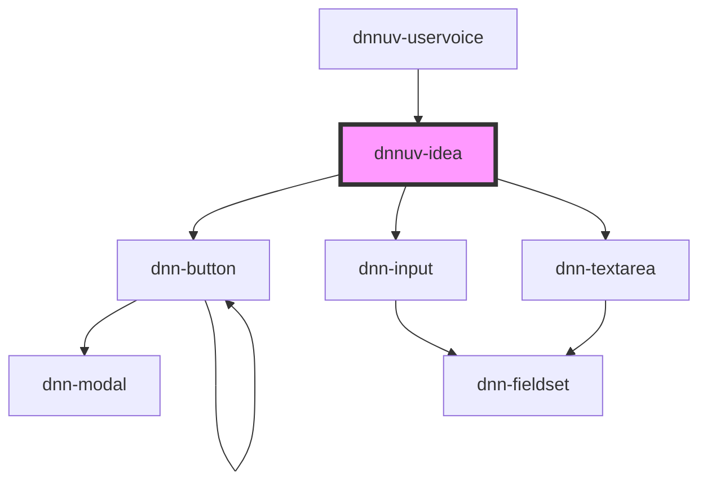

# dnnuv-idea

<!-- Auto Generated Below -->

## Properties

| Property              | Attribute | Description                    | Type     | Default     |
| --------------------- | --------- | ------------------------------ | -------- | ----------- |
| `ideaId` _(required)_ | `idea-id` | The ID of the idea to display. | `number` | `undefined` |

## Dependencies

### Used by

 - [dnnuv-uservoice](../dnnuv-uservoice)

### Depends on

- dnn-button
- dnn-input
- dnn-textarea

### Graph

----------------------------------------------

*Built with [StencilJS](https://stenciljs.com/)*
