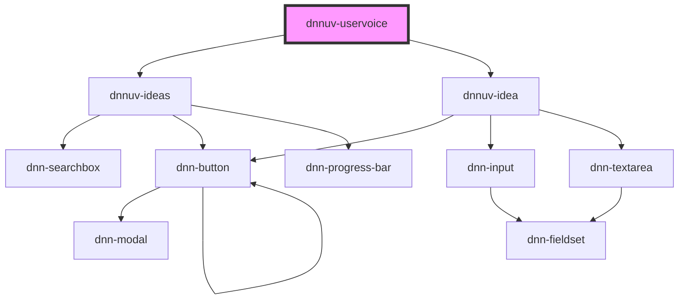

# dnnuv-uservoice

<!-- Auto Generated Below -->

## Properties

| Property                | Attribute   | Description                  | Type     | Default     |
| ----------------------- | ----------- | ---------------------------- | -------- | ----------- |
| `moduleId` _(required)_ | `module-id` | The ID of the current module | `number` | `undefined` |
| `userId`                | `user-id`   | The ID of the current user   | `number` | `undefined` |

## Dependencies

### Depends on

- [dnnuv-ideas](../dnnuv-ideas)
- [dnnuv-idea](../dnnuv-idea)

### Graph

----------------------------------------------

*Built with [StencilJS](https://stenciljs.com/)*
